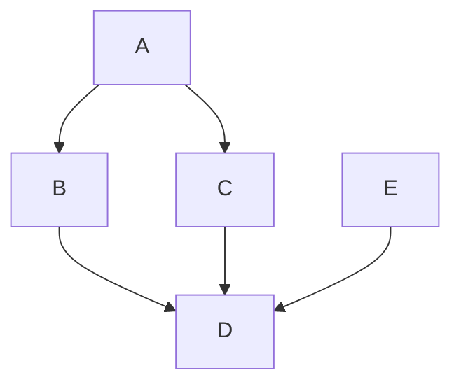

# This is an H1 2016-01-01

Headers Joy :joy:

Headers Joy :joy:

## This is an H2

###### This is an H6

Bullet Points

- Red

- Green

- Blue

Numbered Lists

1. Bird

2. McHale

3. Parish

Emphasis (Italics)
_text_

_text_

Strong (Bold)

**text**

**text**

| column1 |  column2  |  column3 |
| :------ | :-------: | -------: |
| 1       |     2     |        3 |
| test    | ~~cross~~ | **both** |

# Hello Markdown with LaTeX

This is a quadratic equation $ax^2 + bx + c = 0$ inline.

And here is a block equation:

$$
\mathbb{E}(X) = \int x d F(x) = \left\{ \begin{aligned} \sum_x x f(x) \; & \text{ if } X \text{ is discrete}
\\ \int x f(x) dx \; & \text{ if } X \text{ is continuous }
\end{aligned} \right.
$$



```go
package main

func main() {
	fmt.Println("ok")
}
```
