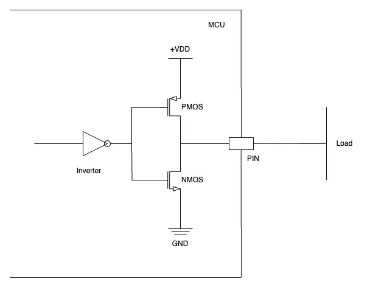
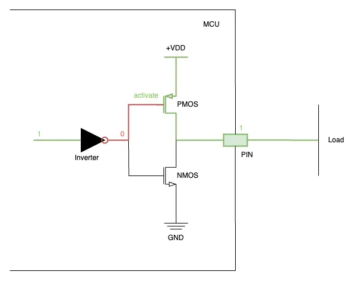
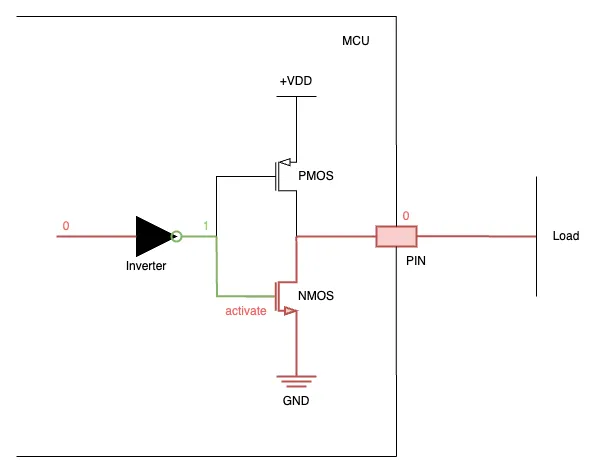

# พื้นฐานของ GPIO และเรื่องที่เกี่ยวข้อง

ไม่ว่าใครก็ตามที่เริ่มเข้าวงการ embedded system หรือจะมาลองๆเล่นๆกับบรรดา microcontroller board ก็ต้องเริ่มจากการใช้ GPIO เพื่อเปิดไฟ LED กันทุกคน จนเหมือนกับว่ามันเป็น Hello World ของการเริ่มพัฒนาอุปกรณ์สมองกลต่างๆ

แต่แม้ GPIO จะดูใช้งานง่ายๆ จนเป็นจุดเริ่มต้นของใครหลายๆคน และถูกใช้งานตามๆกันมาจนอาจจะทำให้หลงลืมไปว่ามันทำงานได้ยังไง ต่อวงจรแบบไหนมีผลยังไง และทำอะไรได้อีกบ้าง ซึ่งเป็นจุดสำคัญมากๆต่อการออกแบบและดูแลระบบ โดยเฉพาะกับคนที่ไม่ได้เรียนไฟฟ้ามา

ในบทความนี้ก็จะชำแหละ GPIO เพื่อรวบรวมข้อมูลเท่าที่รู้เอาไว้ให้ได้มากที่สุด เผื่อว่าจะลืม :D

## 0. พื้นฐานที่ควรรู้ก่อน

เผื่อคนที่ไม่ได้อยู่ในสายวิศวกรรมไฟฟ้า หรือคืนอาจารย์ไปหมดแล้ว ก็ขอใช้พื้นที่ตรงนี้ในการทบทวนก่อนแล้วกัน

1. High impedance Pin (Hi-Z)
  คือขา I/O ที่อยู่ในสถานะที่มีความต้านทานสูงมากๆๆ กระแสไฟแทบจะไม่มีเลย และเมื่อไม่มีกระแสไหล การกินพลังงานก็จะน้อยลง และไม่มีสัญญาณไปรบกวนกันสายสัญญาณอื่นๆ สถานะนี้มักเรียกว่า "Tri-state" หรือ "Hi-Z" (High Impedance State)
2. Floating Pin
  คือขาที่เราปล่อยลอยๆ ไม่ต่อกับวงจรภายนอกเลย และระบบก็ไม่ได้ขับสัญญาณอะไรออกมา ระดับแรงดันไฟฟ้าก็จะวัดไม่ได้เพราะไม่ครบวงจร
3. GPIO Port
  คือกลุ่มของ GPIO Pin
4. Digital Signal
   สัญญาณรูปแบบ digital ซึ่งจะมี 2 สถานะคือ Logic '0' และ Logic '1' ซึ่งจะใช้ระดับแรงดันไฟฟ้าในการแบ่งสัญญาณ โดยจะมีความเป็นไปได้ 3 แบบคือ ~0V , ~Vcc และ Tri-state

---

## 1. GPIO คืออะไร

GPIO หรือชื่อเต็มๆก็คือ General-Purpose Input/Output คือส่วนประกอบหลักในการทำงานของอุปกรณ์อิเล็กทรอนิกส์แทบทุกประเภท โดยเฉพาะบน Microcontroller คิดง่ายๆเลยว่าถ้าอันไหนมีปุ่มกด มีไฟวิบวับ อันนั้นก็คือใช้งาน GPIO ทั้งนั้น เพราะเป็นตัวกลางหลักในการส่งสัญญาณเข้าและออกจาก Microcontroller ซึ่งสามารถกำหนดให้ทำงานได้ตามโปรแกรมที่ถูกตั้งไว้

รูปแบบของ GPIO จะขอแบ่งออกเป็น 4 รูปแบบคือ

1. Digital Output
2. Digital Input
3. Analog Input
4. Alternate Function Output

*** บางที่บางตำราอาจจะแบ่งได้มากน้อยหรือแตกต่างไปจากนี้ แต่ตรงนี้ไม่ใช่ประเด็นสำคัญอะไร เป็นเพียงการแยกแยะให้ดูเข้าใจง่ายๆ เฉยๆ

## 2. GPIO

### 2.1 Digital Output

หากเคยทำ LED ให้สว่างได้ แสดงว่าเคยใช้ Digital Output แน่นอน

#### Push-Pull Output

<i align="center">
  schematic แบบง่ายๆ ของ push-pull output
</i>

Push-Pull เป็น config ที่จะได้ใช้งานกันบ่อยๆ ในรูปจะเป็น push-pull output แบบง่ายๆ ตัดส่วนที่ยังไม่เกี่ยวข้องออกไป ของจริงจะหยุบหยับกว่านี้
การในการทำงานของแบบ Push-Pull สามารถมีได้ 2 รูปแบบคือ
 - Push/Source ส่งกระแสไฟฟ้าจากแหล่งจ่ายไฟ (VDD) เข้า Load
 - Pull/Sink ดึงกระแสไฟฟ้าจาก Load ลงกราวน์ (GND)

<i align="center">
  กระบวนการในช่วงของการ Push/Source
</i>

<i align="center">
  กระบวนการในช่วงของการ Pull/Sink
</i>

สำหรับ internal GPIO ใน microcontroller จะมีการใช้ PMOS transistor ต่อกับ VDD และ NMOS transistor ต่อกับ GND ในการทำ Push-Pull ซึ่งก็จะมีช่วงการทำงานแยกกันตามรูป

- Push phase: เมื่อเราสั่ง Logic '1' จาก MCU สัญญาณก็จะถูก invert หรือเปลี่ยนจาก Logic จาก '1' เป็น '0' ซึ่งจะทำให้ PMOS นั้น activate ทำให้กระแสจาก VDD ไหลลงมาที่ Output Pin กลายเป็น Logic '0'
- Pull phase: ในขณะที่ Logic '0' ก็จะถูก invert สัญญาณเช่นกัน จะทำให้ NMOS นั้น activate แทน กระแสจาก Output Pin จึงไหลลง GND กลายเป็น Logic '0'

จะเห็นว่ารูปแบบนี้ไม่ได้เหมาะกับการแชร์สายสัญญาณร่วมกับหลายๆ อุปกรณ์เลย เพราะอาจจะทำให้กระแสไฟจาก MCU ถูกดึงลงกราวน์จากอุปกรณ์อื่น หรือไปหาดึงกระแสไฟชาวบ้านเขาได้ จึงมักจะเห็นใช้กันกับพวกสัญญาณที่มีการวิ่งทางเดียวมากกว่า (เช่น SPI หรือ UART) หรือจะเอาไว้ขับพวกอุปกรณ์โดยตรงอย่างเช่น LED หรือ Relay

ในกรณีที่อยากจะเปลี่ยนจาก Output เป็น Input ด้วยรูปแบบ Push-Pull เองสามารถเปลี่ยนเป็น Input ได้โดยการปิด transistor ทั้ง 2 ตัวเพื่อให้ Output Pin มีสถานะเป็น Hi-Z ซึ่งเดี๋ยวจะพูดถึงใน Digital Input

#### Open-drain Output

<i align="center">
  schematic แบบง่ายๆ ของ open-drain output
</i>

สำหรับ Open-drain Output ภายในก็จะมีส่วนที่เหมือนกับ Push-pull ตรงที่ใช้ NMOS transister กับการทำ Logic '0' ดังนั้น Logic '0' จึงมีพฤติกรรมแบบเดียวกัน นั่นคือดึงกระแสจาก Output Pin จะไหลลง GND จนกลายเป็น Logic '0'

<i align="center">
  กระบวนการในช่วงของการส่ง Logic '0' และดึงกระแสไฟลง
</i>

แต่ในกรณี Logic '1' นั้น Output Pin จะกลายเป็นวงจรเปิด ทำให้ไม่มีกระแสไหล และกลายเป็น Hi-Z ดังนั้น Open drain จึงต้องมาพร้อมกับท่า Pull-up resister แบบในรูปเพื่อให้ Output Pin เกิดแรงดันเป็น Logic '1' ได้ในสถานการณ์แบบนี้

<i align="center">
  กระบวนการในช่วงของการส่ง Logic '1' จาก Pull-up resister
</i>

ข้อดีของการเปิดขาเป็น Open-drain คือ เราสามารถที่จะต่อไฟเลี้ยงได้ตามใจชอบ โดยสามารถที่จะดึงมาจากแหล่งจ่ายไฟจากภายนอก มาจ่าย Output Pin แทนที่จะมาจาก MCU ตรงๆ ซึ่งอาจจะถูกจำกัดปริมาณกระแสจาก I/O หรือแรงดันไม่เหมาะกับอุปกรณ์ปลายทาง

#### GPIO Output Speed

ความเร็วของ GPIO Output จะหมายถึงความเร็วในการเปลี่ยนขอบขาหรือ Logic State จาก '0' เป็น '1' หรือ จาก '1' เป็น '0' ว่าทำได้เร็วแค่ไหน แต่ยิ่งเปลี่ยนได้เร็วก็จะยิ่งกินพลังงาน และ EMI noise กวนสัญญาณได้ง่ายขึ้น ดังนั้นเราก็ควรจะตั้งค่า Speed ให้เหมาะกับงานด้วย อย่างเช่น ถ้าเป็น GPIO toggle ง่ายๆ โง่ๆ ก็อาจจะลดไปเหลือ 1Hz (เปลี่ยน state ใน 1 วินาที) ก็ไม่เสียหายเท่าไร หรือถ้าเป็นแบบ SPI อาจจะต้องยอมอัพ speed ขึ้นไปถึง 45MHz เพื่อให้ส่งได้ทันตาม protocol

### 2.2 Digital Input

ปุ่มกดแทบทุกชนิดล้วนมีพื้นฐานมาจาก Digital Input ทั้งนั้น เพราะมันเป็นการแทนค่าจาก Logic '0' คือยังไม่กด Logic '1' คือกดปุ่ม มาดูกันว่าจะสามารถเล่นอะไรกับมันได้บ้าง

#### No Pull-up and no Pull-down (Floating Pin)

GPIO Pin จะปล่อยขาลอยๆ ไว้ และไม่มีการต่ออะไรเพิ่มจากภายใน ซึ่งหากไม่มีการขับสัญญาณจากภายนอกเข้ามา หรือไม่มีต่อวงจรใดๆ ที่ Pin นี้เลย ก็จะทำให้ Pin นี้เป็น Hi-Z

โดยเราจะตั้งค่า Pin ให้เป็นแบบนี้ก็ต่อเมื่อไม่ใช้ Pin นี้ เพราะจะไม่มีการสูญเสียพลังงานเมื่อเทียบกับแบบอื่นๆ
แต่หากจะใช้ Pin นี้ก็จะมีการต่อ Pull-up/Pull-down จากวงจรภายนอก หรือกำหนดสถานะไว้อยู่แล้วว่าเป็น '0' หรือ '1' เพื่อป้องกันการอ่านข้อมูลผิดพลาดจากการเป็นวงจรเปิด

### Pull-up Resister

GPIO Pin จะต่อเข้ากับตัวต้านทานที่ต่อกับแหล่งจ่ายไฟ (Vcc) ทำให้เวลาที่ยังไม่มีการขับสัญญาณไฟฟ้าเข้ามา มันก็จะมีแรงดันเท่ากับแหล่งจ่ายไฟหรือเป็น Logic '1' เสมอ ดังนั้น Pull-up จึงมักจะใช้ควบคู่ไปกับสัญญาณแบบ Active Low เพื่อให้มันอ่านได้ Logic '1' ตอนช่วงที่ไม่เรายังไม่สนใจ และหลีกเลี่ยงปัญหาจากการอ่าน Logic ผิดพลาดจากการปล่อยลอย

### Pull-down Resister

GPIO Pin จะต่อเข้ากับตัวต้านทานที่ต่อกับกราวน์ (0V) ทำให้มันมีแรงดัน 0V หรือเป็น Logic '0' เสมอในเวลาที่ยังไม่มีการขับสัญญาณไฟฟ้าเข้ามา การใช้งานจึงตรงข้ามกับ Pull-up คือคงสถานะ Logic '0' เอาไว้ และรอจังหวะที่ Logic '1' จะถูกขับสัญญาณเข้ามา (Active High)

## Reference

[Open Drain Output vs. Push-Pull Output](https://open4tech.com/open-drain-output-vs-push-pull-output/)
[Why Are Pull-Up and Pull-Down Resistors Used?](https://www.circuitbread.com/ee-faq/why-are-pull-up-and-pull-down-resistors-used)
[PULL-UP AND PULL-DOWN RESISTORS](https://www.circuitbasics.com/pull-up-and-pull-down-resistors/)
[Pull-up Resistors](https://www.electronics-tutorials.ws/logic/pull-up-resistor.html)
