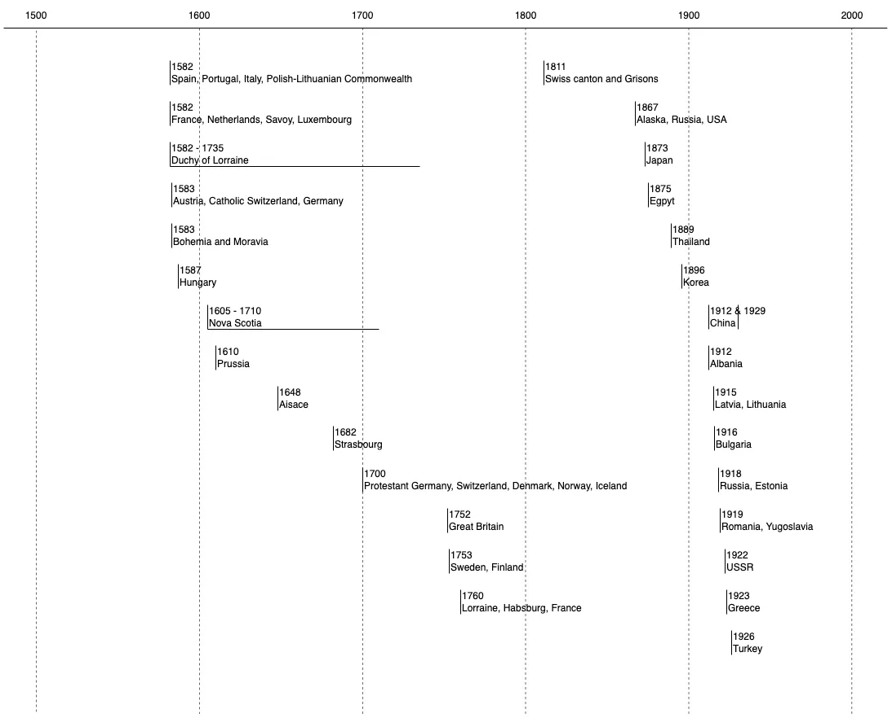
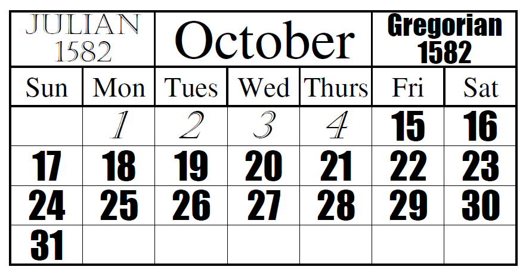

ย้อนไปสมัยวัยเด็ก เคยนั่งดูรายการทีวีช่องหนึ่งซึ่งจำไม่ได้แล้วว่ารายการอะไร มีชายคนหนึ่งที่สามารถบอกวันของสัปดาห์ได้ภายในไม่กี่วินาที แค่เพียงรู้วันที่ เดือน และปีก็บอกได้ทันที ซึ่งน่าทึ่งมาก เพราะหากเราสามารถบอกวันของสัปดาห์ของวันเกิดเพื่อนหรือวันสำคัญต่างๆ ได้เลย ก็จะดูเท่ไม่น้อย พอโตขึ้น อินเทอร์เน็ตเริ่มเข้าถึง พอหวนกลับไปคิดถึงเรื่องนี้ก็เริ่มศึกษาหาวิธีการต่างๆ ดูว่าจะคำนวณอย่างไรได้บ้าง และพบว่ามีหลายวิธีการที่น่าสนใจเลยทีเดียว

ในบทความนี้จึงมาแชร์วิธีการคิดคำนวณหาวันของสัปดาห์ด้วยวิธีการต่างๆ ที่น่าสนใจ ซึ่งก็เป็นเรื่องของคณิตศาสตร์ล้วนๆ 😆

แต่ก่อนจะเริ่มเข้าสู่เนื้อหา เรามาทำความเข้าใจเกี่ยวกับปฏิทินกันก่อน

## ความเป็นมาของปฏิทิน

ย้อนกลับไปสมัยโบราณ มนุษย์เริ่มต้นบันทึกเวลาด้วยการสังเกตธรรมชาติและปรากฏการณ์ทางดาราศาสตร์ อาณาจักรเมโสโปเตเมีย (Mesopotamia) และ (Babylonia) พัฒนาปฏิทินจากรอบจันทรคติเป็นหลัก ขณะที่อาณาจักรอียิปต์โบราณใช้ดวงอาทิตย์เป็นหลัก ปฏิทินยุคนั้นจะมี 12 เดือน เดือนละ 29-30 วัน และมีการเพิ่มวันพิเศษเข้าไปเพื่อให้ตรงกับฤดูกาล

มาถึงยุคโรมัน (ประมาณ 753 ปีก่อนคริสตกาล) เดิมทีจะมีแค่ 10 เดือน เพราะใช้แค่ในการทำเกษตรกรรม จะไม่นับช่วงฤดูหนาว แต่เพื่อให้การดำเนินกิจการงานอื่นๆ ต่อเนื่องได้ทั้งปี รวมไปถึงเรื่องศาสนาและวัฒนธรรมของชาวโรมัน จึงเพิ่มเดือนมกราคม (Januarius) และกุมภาพันธ์ (Februarius) เข้ามาเพื่อให้สอดคล้องกับปีสุริยคติ โดยมีประมาณ 355 วัน แต่ก็ยังไม่แม่นยำเท่าไหร่ ไม่กี่ร้อยปีก็คาดเคลื่อนเป็นเดือนๆ แล้ว

เพื่อแก้ปัญหานี้ จูเลียส ซีซาร์ (Julius Caesar) ได้จัดทำ (Julian calendar) ขึ้นมาในปี 46 ก่อนคริสตกาล ปฏิทินจูเลียนมี 12 เดือน เดือนละ 30 หรือ 31 วัน ยกเว้นเดือนกุมภาพันธ์ที่มี 28 วัน และทุกๆ 4 ปี เดือนกุมภาพันธ์จะมี 29 วัน เพื่อให้ปีนั้นมี 366 วัน ทำให้เวลาเฉลี่ยอยู่ที่ 365.25 วัน ซึ่งใกล้เคียงกับปีสุริยคติที่มีประมาณ 365.2422 วัน

แม้ว่าการคลาดเคลื่อนไปประมาณ 11 นาทีต่อปีจะไม่มาก แต่พอเวลาผ่านไปเป็นพันปี ผลกระทบก็เพิ่มมากขึ้น จนคลาดเคลื่อนเป็นสัปดาห์ การปลูกพืชผลก็เริ่มไม่ตรงตามฤดูกาล การประกอบพิธีกรรมก็ไม่ตรงเวลา ปัญหานี้ทำให้ต้องมีการปรับปรุงอีกครั้งในปี 1582 โดยสมเด็จพระสันตะปาปาเกรกอรีที่ 13 (Gregory XIII) นำปฏิทินเกรกอเรียน (Gregorian Calendar) มาใช้ กฎใหม่คือ
 - ปีที่หารด้วย 4 ลงตัวเป็นปีอธิกสุรทิน
 - ยกเว้นปีที่หารด้วย 100 ลงตัว จะไม่เป็นปีอธิกสุรทิน
 - ยกเว้นปีที่หารด้วย 400 ลงตัว จะเป็นปีอธิกสุรทิน
ทำให้เวลาเฉลี่ยอยู่ที่ 365.2425 วัน คาดเคลื่อนประมาณ 26 วินาทีต่อปี ซึ่งจะต้องใช้เวลาสามพันกว่าปีจึงจะคลาดเคลื่อน 1 วัน

การเปลี่ยนปฏิทินเกิดขึ้นในเดือนตุลาคม ค.ศ. 1582 โดยเริ่มเปลี่ยนวันศุกร์ที่ 5 ตุลาคม ค.ศ. 1582 ตามปฏิทินจูเลียน ถูกปรับเปลี่ยนให้เป็นวันศุกร์ที่ 15 ตุลาคม ค.ศ. 1582 ตามปฏิทินเกรกอเรียน ซึ่งทำให้วันที่ 5 ถึงวันที่ 14 ตุลาคม ค.ศ. 1582 นั้นหายไป

แต่ในประเทศต่างๆ ก็ไม่ได้เปลี่ยนแปลงในช่วงเวลาเดียวกัน บางประเทศก็ใช้เวลาเป็นหลายร้อยปีกว่าจะเปลี่ยนมาใช้ และเริ่มทยอยเปลี่ยนแปลงกันเรื่อยๆ จนในที่สุดปฏิทินเกรกอเรียนจึงเป็นปฏิทินที่ใช้กันอย่างแพร่หลายในหลายประเทศทั่วโลก

สำหรับประเทศไทย ในอดีตเราจะใช้ปฏิทินจันทรคติ จนถึงรัชสมัยพระบาทสมเด็จพระจอมเกล้าเจ้าอยู่หัว (รัชกาลที่ ๕) ได้โปรดเกล้าฯ เปลี่ยนจากปฏิทินจันทรคติมาใช้ปฏิทินสุริยคติแบบสากลตามปฏิทินเกรกอเรียนแทนที่ในปี พ.ศ. 2432 (ค.ศ. 1889) โดยกำหนดให้เดือนแรกของปีคือเดือนเมษายน (1 เมษายน คือวันเริ่มปีใหม่) เพื่อให้สอดคล้องกับการเปลี่ยนแปลงของฤดูกาลและทำเกษตรกรรม ซึ่ง สอดคล้องกับประเพณีและวิถีชีวิตของคนไทยในสมัยนั้นมากกว่า ช่วงเดือนมกราคมถึงมีนาคมจึงมีปีที่เหลื่อมกับของทางฝั่งยุโรปอยู่ 1 ปี

ภายหลังเมื่อโลกเริ่มมีการติดต่อและทำการค้าระหว่างประเทศมากขึ้น จอมพล ป. พิบูลสงคราม จึงเปลี่ยนมาใช้วันที่ 1 มกราคมเป็นวันปีใหม่ตั้งแต่ปี พ.ศ. 2484 (ค.ศ. 1941) เพื่อให้สอดคล้องกับปฏิทินสากลและการปฏิรูปเพื่อความทันสมัยตามสากลโลก

## ก่อนเริ่มต้น เราต้องรู้อะไรบ้าง

จากประวัติศาสตร์ทำให้เรารู้ว่า หากจะคำนวณให้ถูกต้องตามประวัติศาสตร์มนุษยชาติ ก่อนวันที่ 5 ตุลาคม ค.ศ. 1582 จะใช้เวลาตามปฏิทินจูเลียน และตั้งแต่วันที่ 15 ตุลาคม ค.ศ. 1582 จะใช้เวลาตามปฏิทินเกรกอเรียนตามเวลาเผยแพร่และการเริ่มใช้งาน ช่วงวันที่ 4 ถึงวันที่ 14 ตุลาคม ค.ศ. 1582 ก็ปล่อยเบลอไปเลย

หรือหากจะนับช่วงที่เริ่มมีการเปลี่ยนมากขึ้นก็จะเป็นช่วงปี ค.ศ. 1752 ในวันพฤหัสบดีที่ 3 กันยายน ตามปฏิทินจูเลียนเป็นวันพฤหัสบดีที่ 14 กันยายนตามปฏิทินเกรกอเรียน

แต่ถ้าหากจะให้เป็ะๆ ก็คงจะต้องมาเช็คล่ะว่าประเทศไหน เปลี่ยนกันวันไหน ปีไหน ซึ่งก็ยากเกินไป เอาเป็นว่ายึดตามวันเวลาที่ปล่อยใช้ดีกว่า หรือก็ต้องบอกว่าจะให้คำนวณตามปฏิทินไหน

สำหรับประเทศไทย ก่อนปี ค.ศ. 1889 จะคำนวณได้ยากจากระบบการนับข้างขึ้นข้างแรมของปฏิทินจันทรคติ ช่วง ค.ศ. 1888 - 1940 ก็จะวุ่นวายเล็กน้อยในช่วงเดือนมกราคม ถึงเดือนมีนาคม จนหลังปรับเปลี่ยนปฏิทิน ค.ศ. 1941 ถึงจะเข้าสูตรการคำนวณปกติ 😂

หากต้องการแปลงจาก พ.ศ. เป็น ค.ศ. ก็ให้เอาไปลบกับ 543 ออก ก็จะได้เป็นปี ค.ศ. แล้ว

### 1. ความเข้าใจพื้นฐานเกี่ยวกับการคำนวณวันของสัปดาห์

แน่นอนว่าเมื่อพูดถึงการคำนวณแล้ว คณิตศาสตร์ก็ต้องมา ซึ่งวิธีการคำนวณนี้ไม่ได้ยากเย็นอย่างที่คิด เพราะใช้แค่ความรู้ระดับประถม เช่น การบวก ลบ คูณ หาร และการหารเอาเฉพาะเศษ (modular) เท่านั้น โดยเฉพาะการใช้ mod 7 ที่ช่วยในการหาวันของสัปดาห์ และลดความซับซ้อนในการคำนวณได้ โดยหลักการคือการหารด้วย 7 แล้วเอาเฉพาะค่าเศษที่เหลืออยู่มาระบุวันของสัปดาห์ ตัวอย่างเช่น 37 mod 7 จะได้เศษ 2 เป็นคำตอบ

เราสามารถแปลงที่ได้จากการ mod 7 (0 - 6) เป็นวันของสัปดาห์ได้ดังนี้

| Code  | Day of week |
| :---: | :---------- |
|   0   | วันอาทิตย์     |
|   1   | วันจันทร์      |
|   2   | วันอังคาร     |
|   3   | วันพุธ        |
|   4   | วันพฤหัสบดี    |
|   5   | วันศุกร์       |
|   6   | วันเสาร์      |

### 2. ความสำคัญของการจดจำและความแม่นยำ

สิ่งที่สำคัญที่สุดอีกอย่างหนึ่งก็คือความจำ ถ้าจำไม่ได้ หรือไม่แม่นก็จบตั้งแต่ยังไม่เริ่มคำนวณ ช่วงแรกอาจต้องจำเยอะหน่อย แต่ไม่ยากเกินไป และถ้าฝึกจนคล่องแล้วก็จะเหลือเพียงแค่ความชำนาญ

### 3. วิธีการคำนวณวันในสัปดาห์

วิธีการคิดคำนวณวันในสัปดาห์มีสองวิธีหลักๆ คือ สูตรของซัลเลอร์ (Zeller's Congruence) และ Doomsday Algorithm ซึ่งทั้งสองวิธีสามารถใช้ได้และให้ผลลัพธ์ที่ถูกต้อง ขึ้นอยู่กับความสะดวกและความชอบส่วนตัวในการเลือกใช้วิธีการคำนวณ แต่ในการคิดในใจเราจะใช้วิธีที่ 3 ที่จะพลิกแพลง และดัดแปลงจาก 2 วิธีข้างบนเล็กน้อย เพื่อให้คำนวณง่าย และเร็วขึ้น

โดยหลักๆ แล้วการคำนวณนี้จะมีการหาตัวแปร 5 ตัว ดังนี้:

- Day Code: ค่าเฉพาะของวันในเดือน
- Month Code: ค่าเฉพาะของเดือน
- Year Code: ค่าเฉพาะปี
- Century Code: ค่าเฉพาะของศตวรรษ
- Leap Year Modifier: ตัวปรับแก้สำหรับปีอธิกสุรทิน (Leap Year)

ซึ่งในแต่ละวิธีก็จะมีวิธีการหาแตกต่างกันไป ขึ้นอยู่กับมุมมองของแต่ละสูตร

### 4. การหาว่าเป็นปีอธิกสุรทิน (leap year) หรือไม่

อีกสิ่งที่ต้องดูแล้วรู้เลยก็คือ ปีนั้นๆ เป็น leap year หรือไม่ ซึ่งจะต้องเป็นไปตามเงื่อนไขต่อไปนี้

สำหรับปฏิทินจูเลียน
- ต้องหารด้วย 4 ลงตัว

สำหรับปฏิทินเกรกอเรียน
- ต้องหารด้วย 4 ลงตัว
- ปีที่ลงท้ายด้วย 00 จะต้องหารด้วย 400 ลงตัวด้วย

### 5. เครื่องมือช่วยในการตรวจสอบ

สุดท้าย เราสามารถใช้ https://www.timeanddate.com/date/weekday.html ในการตรวจสอบการคำนวณเราได้ มีบอกด้วยว่าวันไหนจะใช้ปฏิทินอะไร

## 1. Zeller's Congruence

สูตรของซัลเลอร์ (Zeller's Congruence) อาจจะเหมาะสำหรับการคำนวณที่ต้องการความแม่นยำและมีเวลาคำนวณ แต่อาจจะไม่สะดวกสำหรับการคิดในใจเพราะการคำนวณที่ซับซ้อน แต่ถ้าเข้าใจหลักการและวิธีการคำนวณของสูตรของซัลเลอร์อย่างดี ดัดแปลงซักเล็กน้อย เราก็สามารถคำนวณหาวันของสัปดาห์จากวันเดือนปีในใจได้อย่างรวดเร็ว โดยตัวสูตรจะหาวันของสัปดาห์ได้ตามสมการด้านล่าง

สำหรับปฏิทินเกรกอเรียน:

$$ h = (q + ⌊\frac{13(m + 1)}{5}⌋ + ⌊\frac{J}{4}⌋ + 5J + K + ⌊\frac{K}{4}⌋ + 6) \bmod{7} $$

สำหรับปฏิทินจูเลียน:

$$ h = (q + ⌊\frac{13(m + 1)}{5}⌋ + (5 - J) + K + ⌊\frac{K}{4}⌋ + 6) \bmod{7} $$

โดยที่:
  - h คือ วันของสัปดาห์ (0 = อาทิตย์, 1 = จันทร์, ..., 5 = ศุกร์, 6 = เสาร์)
  - q คือ วันที่ของเดือน
  - m คือ เดือน (3 = มีนาคม, 4 = เมษายน, ..., 12 = ธันวาคม, มกราคมและกุมภาพันธ์นับเป็นเดือนที่ 13 และ 14 ของปีที่แล้ว)
  - K คือ สองหลักสุดท้ายของปี หรือ ปีในทศวรรษ (เช่น ถ้าปีคือ 2016, K คือ 16)
  - J คือ สองหลักแรกของปี หรือ ศตวรรษ (เช่น ถ้าปีคือ 2016, J คือ 20)
  - +6 เพื่อเป็น offset ให้เลขตรงกับวันของสัปดาห์ที่คุ้นเคย

### ขั้นตอนการคำนวณ

#### 1. การหาค่าของวัน (Day Code: q)

Day code สามารถหาได้ง่ายๆ เพราะมันก็คือตัวเลขวันที่ โดยสามารถ mod 7 ได้ก่อนเลย

#### 2. การหาค่าของเดือน (Month Code: $⌊\frac{13(m+1)}{5}⌋$)

Month Code จะเริ่มต้องใช้ความจำเล็กน้อย โดยหลักการแล้วจะเริ่มจาก
 - สำหรับเดือนมกราคมและกุมภาพันธ์ ให้ถือว่าเป็นเดือนที่ 13 และ 14 ของปีที่แล้ว และใช้ค่าปีที่แล้วในการคำนวณแทน
 - สำหรับเดือนมีนาคมถึงธันวาคม ให้ใช้เลขเดือนตามปกติได้เลย

ซึ่งหากนำมาเข้าสมการหาค่าของเดือนด้วยสูตร $⌊\frac{13(m+1)}{5}⌋$ เราจะได้ค่าตามตาราง

| เดือน (m)      | $⌊\frac{13(m+1)}{5}⌋$ | Month Code |
| :------------ | :-------------------: | :--------: |
| มกราคม (13)   |          36           |     1      |
| กุมภาพันธ์ (14)  |          39           |     4      |
| มีนาคม (3)     |          10           |     3      |
| เมษายน (4)    |          13           |     6      |
| พฤษภาคม (5)   |          15           |     1      |
| มิถุนายน (6)    |          18           |     4      |
| กรกฏาคม (7)   |          20           |     6      |
| สิงหาคม (8)    |          23           |     2      |
| กันยายน (9)    |          26           |     5      |
| ตุลาคม (10)    |          28           |     0      |
| พฤศจิกายน (11) |          31           |     3      |
| ธันวาคม (12)   |          33           |     5      |

ใครใคร่จำก็จำตัวเลขใน Month Code เอาไปใช้แทนได้เลย ส่วนใครไม่อยากจำก็ต้องคำนวณจากสูตรเอาเองนะ 😋

#### 3. การหาค่าของศตวรรษ (Century Code: C)

ส่วนสุดท้าย คือสองหลักแรกของปี ถ้าโดนลบ 1 จากรอบที่แล้วก็ใช้ปีที่โดนลบ โดยเราจะใช้สูตร

$$ C = ⌊\frac{J}{4}⌋ + 5J $$

หรือถ้าคิดแบบปฏิทินจูเลียนก็เปลี่ยนเป็น

$$ C = 5 - J $$

#### 4. การหาค่าของปี (Year Code: Y)

จากการหาค่าของเดือนมีเงื่อนไขคือ ถ้าเป็น 2 เดือนแรกจะใช้เลขปีที่แล้วแทน เพราะวันที่เราเพิ่มเข้าไปในปี leap year คือวันที่ 29 กุมภาพันธ์ การนับเป็นเดือนที่ 13 และ 14 ของปีที่แล้วแทนเลขเดือนปกติ จึงเป็นเทคนิคที่ช่วยให้คำนวณง่ายขึ้น ดังนั้นอย่างลืมลบปีด้วย 1 เสมอ แต่ในเดือนอื่นๆ ไม่ต้องลบนะ

ส่วนที่จะคำนวณหาค่าของปีคือสองหลักสุดท้าย เราจะเอาเข้าสมการ

$$ Y = K + ⌊\frac{K}{4}⌋ $$

#### 5. คำนวณผลลัพท์ทั้งหมด

จากสูตรเราจะบวก Code ทั้งหมดเข้าไปและบวกอีก 6 เพื่อให้ Weekday Code ตรงกับที่เราจำไว้ โดยสมการสุดท้ายจะเป็นดังนี้

$$ h = (D + M  + C + Y + 6) \bmod{7} $$

ถ้าอยากให้บวกเลขน้อยลงก็สามารถกระจาย mod 7 เข้าไปใน Code แต่ละอันก่อนได้เลย

### ตัวอย่าง

1. Y2K: วันที่ 1 มกราคม 2000

| ขั้นตอน |    D    |    M    |               C                |           Y           | comment |
| :---- | :-----: | :-----: | :----------------------------: | :-------------------: | :------ |
| ตัวแปร |    1    |    1    |               19               |          99           | ใช้ปีที่แล้ว |
| สมการ | (เลขวัน) | (ตาราง) |      $⌊\frac{J}{4}⌋ + 5J$      |  $K + ⌊\frac{K}{4}⌋$  |         |
| แทนค่า |    1    |    1    | $⌊\frac{19}{4}⌋ + 5\times{19}$ | $99 + ⌊\frac{99}{4}⌋$ |         |
| ผลลัพท์ |    1    |    1    |          4 + 95 = 99           |     99 + 24 = 123     |         |
| mod 7 |    1    |    1    |               1                |           4           |         |

h = (1 + 1 + 4 + 6) mod 7 = 6 (วันเสาร์)

1. วันเกิด Albert Einstein: 14 มีนาคม 1879

| ขั้นตอน |    D    |    M    |               C                |           Y           | comment |
| :---- | :-----: | :-----: | :----------------------------: | :-------------------: | :------ |
| ตัวแปร |   14    |    3    |               18               |          79           |         |
| สมการ | (เลขวัน) | (ตาราง) |      $⌊\frac{J}{4}⌋ + 5J$      |  $K + ⌊\frac{K}{4}⌋$  |         |
| แทนค่า |    1    |    1    | $⌊\frac{18}{4}⌋ + 5\times{18}$ | $79 + ⌊\frac{79}{4}⌋$ |         |
| ผลลัพท์ |   14    |    3    |          4 + 90 = 94           |     79 + 19 = 98      |         |
| mod 7 |    0    |    3    |               3                |           0           |         |

h = (0 + 3 + 3 + 0 + 6) mod 7 = 5 (วันศุกร์)

1. ก้าวที่ยิ่งใหญ่ของมนุษยชาติบนดวงจันทร์: 20 กรกฏาคม 1969

| ขั้นตอน |    D    |    M    |               C                |           Y           | comment |
| :---- | :-----: | :-----: | :----------------------------: | :-------------------: | :------ |
| ตัวแปร |   20    |    7    |               19               |          69           |         |
| สมการ | (เลขวัน) | (ตาราง) |      $⌊\frac{J}{4}⌋ + 5J$      |  $K + ⌊\frac{K}{4}⌋$  |         |
| แทนค่า |   20    |    6    | $⌊\frac{19}{4}⌋ + 5\times{19}$ | $69 + ⌊\frac{69}{4}⌋$ |         |
| ผลลัพท์ |   20    |    6    |          4 + 95 = 99           |     69 + 17 = 86      |         |
| mod 7 |    6    |    6    |               1                |           2           |         |

h = (6 + 6 + 1 + 2 + 6) mod 7 = 0 (วันอาทิตย์)

4. จักรวรรดิโรมันล่มสลาย: 24 สิงหาคม 410

| ขั้นตอน |    D    |    M    |    C    |           Y           | comment   |
| :---- | :-----: | :-----: | :-----: | :-------------------: | :-------- |
| ตัวแปร |   24    |    8    |    4    |          10           |           |
| สมการ | (เลขวัน) | (ตาราง) | $5 - J$ |  $K + ⌊\frac{K}{4}⌋$  | ปฏิทินจูเลียน |
| แทนค่า |   24    |    2    |  5 - 4  | $10 + ⌊\frac{10}{4}⌋$ |           |
| ผลลัพท์ |   24    |    2    |    1    |      10 + 2 = 12      |           |
| mod 7 |    3    |    2    |    1    |           5           |           |

h = (3 + 2 + 1 + 5 + 6) mod 7 = 3 (วันพุธ)

1. คริสโตเฟอร์ โคลัมบัส ค้นพบทวีปอเมริกา: 12 ตุลาคม 1492

| ขั้นตอน |    D    |    M    |    C    |           Y           | comment   |
| :---- | :-----: | :-----: | :-----: | :-------------------: | :-------- |
| ตัวแปร |   12    |   10    |   14    |          92           |           |
| สมการ | (เลขวัน) | (ตาราง) | $5 - J$ |  $K + ⌊\frac{K}{4}⌋$  | ปฏิทินจูเลียน |
| แทนค่า |   12    |    0    | 5 - 14  | $92 + ⌊\frac{92}{4}⌋$ |           |
| ผลลัพท์ |   12    |    0    |   -9    |     92 + 23 = 115     |           |
| mod 7 |    5    |    0    |   -9    |           3           |           |

h = (5 + 0 - 9 + 3 + 6) mod 7 = 5 (วันศุกร์)

### สรุป

ดูเหมือนว่าการคูณ 5 หรือการบวกเลขเป็นร้อยในใจ ไม่ใช่เรื่องง่ายเลย ยังไม่รวมถึงการ mod 7 ด้วยเลขหลักร้อย ซึ่งถ้าจะคิดในใจก็คงจะไม่แนะนำวิธีนี้ซักเท่าไร แต่ถ้าใช้คอมพิวเตอร์คิด ก็ช่วยให้เข้าใจง่าย และใช้ตัวแลขจากวัน เวลาแทนค่าไปได้เลยตรงๆ จึงเหมาะสำหรับโปรแกรมคอมพิวเตอร์ซะมากกว่า

## 2. Doomsday Method

เพื่อที่จะหาวันของสัปดาห์ได้รวดเร็วยิ่งขึ้น Dr. John Horton Conway จึงคิดค้นวิธี Doomsday Method ขึ้นมา โดยมีการอ้างอิงถึงวันที่จะเป็นวันเดียวกันของทุกปี โดยมาจากหลักการที่ว่าถ้าเรารู้ว่าวันที่ 1 มกราคมคือวันเสาร์ อีก 2 อาทิตย์ (15 มกราคม) ก็ยังเป็นวันเสาร์เสมอ และวันถัดๆ ไปก็จะคงที่เสมอ ดังนั้นในแต่ละเดือน ถ้าเราปักหมุดวันหนึ่งในทุกๆ เดือนที่จะเป็นวันเดียวกันทั้งปี เราก็จะสามารถหาวันของสัปดาห์นั้นๆ ได้เร็วขึ้น

Doomsday Method จึงเหมาะสำหรับการคิดในใจมากกว่าสูตรของซัลเลอร์ แต่วิธีการนี้จะใช้ได้กับปฏิทินแบบเกรกอเรียนเท่านั้น

### ขั้นตอนการคำนวณ

#### 1. การหาค่าของวัน (Day Code)

การหา Day code ก็ไม่ต่างกับสูตรของซัลเลอร์ ใช้วันที่แทนค่าได้เลย

#### 2. การหาค่าของเดือน (Month Code: Doomsday Code)

หลักการจำ Doomsday ง่ายๆ ที่ใช้กันทั่วโลกคือ
 - เดือนเลขคู่ วันจะตามเดือน คือ 4/4, 6/6, 8/8, 10/10 และ 12/12
 - เดือนเลขคี่ หลักการจำที่ใช้กันคือ "I'm work 9-to-5 at 7-11" หรือ "ฉันทำงาน ตั้งแต่ 9 โมงเช้าถึง 5 โมงเย็น ที่ 7-11"
 - เดือนมกราคม จำไปเลยว่าวันที่ 3 ถ้าปีนั้น leap year ก็ +1 เป็น 4
 - อีก 2 เดือนถัดมาจะใช้วันเดียวกันก็คือ วันสุดท้ายของเดือนกุมภาพันธ์ (28 หรือ 29)

ซึ่งตารางของ Doomsday มีดังนี้

| เดือน     | Dooms Day | วิธีจำ             |
| :------- | :-------: | :-------------- |
| มกราคม   |   3 (4)   | จำๆ ไปก่อน        |
| กุมภาพันธ์  |  28 (29)  | วันสุดท้ายของเดือน  |
| มีนาคม    |     0     | ก่อนวันแรกของเดือน |
| เมษายน   |     4     | 4/4             |
| พฤษภาคม  |     9     | 5-to-9          |
| มิถุนายน   |     6     | 6/6             |
| กรกฏาคม  |    11     | 7-11            |
| สิงหาคม   |     8     | 8/8             |
| กันยายน   |     5     | 5-to-9          |
| ตุลาคม    |    10     | 10/10           |
| พฤศจิกายน |     7     | 7-11            |
| ธันวาคม   |    12     | 12/12           |

ซึ่งอย่างที่บอกไป doomsday คือวันเดียวกันในแต่ละเดือน โดยเราจะรู้ว่า doomsday คือวันอะไร ก็จะได้มาจากค่าของปีซึ่งเรียกกันว่า Anchor Day Code

#### 3. การหาค่าของศตวรรษ (Century Code: Century Anchor Day Code)

เพื่อที่จะหาว่า doomsday ในปีนั้นๆ คือวันอะไร สิ่งที่ต้องจำเพิ่มก็คือศตวรรษไหนเป็นวันอะไร แต่เราก็ไม่ได้ใจร้ายให้จำทุกศตวรรษนะ จำแค่ 4 ศตวรรษก็พอเพราะ ทุกๆ 400 ปีมันจะวนกลับมาที่เดิม โดยศตวรรษที่จะจำมีดังนี้

| Century | Year range | Code | Date    |
| :------ | :--------- | :--- | :------ |
| 19th    | 18xx       | 5    | วันศุกร์   |
| 20th    | 19xx       | 3    | วันพุธ    |
| 21th    | 20xx       | 2    | วันอังคาร |
| 22th    | 21xx       | 0    | วันอาทิตย์ |

วิธีการจำก็ตามแต่ประสบการณ์ของแต่ละคน โดยส่วนตัวจะจำแค่เลข 2053 แล้วถ้าเลขสองตัวแรกหาร 4 เหลืิอเศษไหนก็เรียงลำดับเลขตามเศษเริ่มจาก 0

หรือจะใข้สูตร

$$ CAD = 9 - (J\bmod{4}) \times{2} $$

#### 3. การหาค่าของปี (Year Code: Year Anchor Day Code)

การคำนวณถัดมาก็จะเป็นเลขปี 2 ตัวหลัง ซึ่งในแต่ละปีก็จะเลื่อนวันของสัปดาห์ไป 1 วันยกเว้น leap year ที่จะเพิ่มเป็น 2 วัน ตามตัวอย่างในตาราง

 | Year        | Anchor Day | Increase From last year |
 | :---------- | :--------- | :---------------------: |
 | 2000 (leap) | วันอังคาร    |            0            |
 | 2001        | วันพุธ       |           +1            |
 | 2002        | วันพฤหัสบดี   |           +1            |
 | 2103        | วันศุกร์      |           +1            |
 | 2104 (leap) | วันอาทิตย์    |           +2            |
 | 2105        | วันจันทร์     |           +1            |
 | 2106        | วันอังคาร    |           +1            |
 | 2107        | วันพุธ       |           +1            |

 แต่ถ้าจะให้บวกกันตั้งแต่ 1 - 99 ก็ลำบากชีวิตเกินไป เพราะใน 100 ปีเราสามารถคำนวณหาจำนวณ leap year ได้จากปีหารด้วย 4 เราจึงสามารถที่จะใช้สูตรคำนวณเหมือนสูตรของซัลเลอร์​ได้ดังนี้

$$ YAD = K + ⌊\frac{K}{4}⌋ $$

โดยที่:
  - K คือ สองตัวหลังของปี

### คำนวณ

จากทั้งหมดเราจะได้ Day Code, Doomsday Code แล้วก็ Anchor Day Code เราก็สามารถนำคำนวณได้ดังนี้

$$ h = (D - DM) + CAD + YAD \bmod{7} $$

โดยที่:
  - h คือ วันของสัปดาห์ (0 = อาทิตย์, 1 = จันทร์, ..., 5 = ศุกร์, 6 = เสาร์)
  - D คือ วันที่ในเดือน
  - DM คือ Doomsday Code
  - CAD คือ Century Anchor Day Code
  - YAD คือ Year Anchor Day Code

### ตัวอย่าง

1. Y2K: วันที่ 1 มกราคม 2000

| ขั้นตอน |    D    |   DM    |         CAD          |         YAD         | comment   |
| :---- | :-----: | :-----: | :------------------: | :-----------------: | :-------- |
| ตัวแปร |    1    |    1    |          20          |         00          |           |
| สมการ | (เลขวัน) | (ตาราง) | $9 - 2(J \bmod{4})$  | $K + ⌊\frac{K}{4}⌋$ |           |
| แทนค่า |    1    |  3 + 1  | $9 - 2(20 \bmod{4})$ |  $0 + \frac{0}{4}$  | leap year |
| ผลลัพท์ |    1    |    4    |          9           |          0          |           |
| mod 7 |    -    |    -    |          9           |          0          |           |

h = (1 - 4 + 9 + 0) mod 7 = 6 (วันเสาร์)

1. วันเกิด Albert Einstein: 14 มีนาคม 1879

| ขั้นตอน |    D    |   DM    |         CAD          |          YAD          | comment |
| :---- | :-----: | :-----: | :------------------: | :-------------------: | :------ |
| ตัวแปร |   14    |    3    |          18          |          79           |         |
| สมการ | (เลขวัน) | (ตาราง) | $9 - 2(J \bmod{4})$  |  $K + ⌊\frac{K}{4}⌋$  |         |
| แทนค่า |   14    |    0    | $9 - 2(18 \bmod{4})$ | $79 + ⌊\frac{79}{4}⌋$ |         |
| ผลลัพท์ |   14    |    0    |          5           |     79 + 19 = 98      |         |
| mod 7 |    -    |    -    |          5           |           0           |         |

h = (14 - 0 + 5 + 0) mod 7 = 5 (วันศุกร์)

1. ก้าวที่ยิ่งใหญ่ของมนุษยชาติบนดวงจันทร์: 20 กรกฏาคม 1969

| ขั้นตอน |    D    |   DM    |         CAD          |          YAD          | comment |
| :---- | :-----: | :-----: | :------------------: | :-------------------: | :------ |
| ตัวแปร |   20    |    7    |          19          |          69           |         |
| สมการ | (เลขวัน) | (ตาราง) | $9 - 2(J \bmod{4})$  |  $K + ⌊\frac{K}{4}⌋$  |         |
| แทนค่า |   20    |   11    | $9 - 2(19 \bmod{4})$ | $69 + ⌊\frac{69}{4}⌋$ |         |
| ผลลัพท์ |   20    |   11    |          3           |     69 + 17 = 86      |         |
| mod 7 |    -    |    -    |          3           |           2           |         |

 h = (20 - 11 + 3 + 2) mod 7 = 0 (วันอาทิตย์)

## 3. ฉบับปรับปรุง (ไม่มีชื่อสูตร)

วิธีคิดสุดท้าย เป็นวิธีคิดที่ปรับปรุงมาจากแนวคิดของ doomsday และใช้หลักการทางคณิตศาสตร์มาปรับใช้ให้มนุษย์อย่างเราๆ นั้นคำนวณในหัวได้ง่ายขึ้น

สำหรับสูตรนี้ แทนที่จะคิดว่า doomsday คือวันไหน เราก็ตั้งต้นกันที่ปีแรกเลยว่าวันแรกของเดือนคือวันไหน และเปลี่ยนเป็น Month Code ตามแบบแนวคิดของ doomsday และปรับปรุงวิธีการคิดศควรรษและปีให้คิดในใจง่ายขึ้น แถมยังสามารถคิดปฏิทินจูเลียนได้อีกด้วย

### Day Code

ยังเหมือนเดิมไม่เปลี่ยนแปลง เราจะใช้เลขวันที่เป็นเลข Day Code

### Month Code

จาก Doomsday เราจะใช้วิธีการหาวันที่เหมือนกันในแต่ละปีที่จำง่าย แต่วิธีนี้เราก็จำไปเลยว่าวันแรกของเดือนในปีแรกคือวันไหน ก็จะได้ดังตาราง

| เดือน     | Day      | Code  | วิธีจำ                               |
| :------- | :------- | :---: | :-------------------------------- |
| มกราคม   | วันเสาร์   |   6   | มกราคม - 6 ตัวอักษร                 |
| กุมภาพันธ์  | วันอังคาร  |   2   | เดือน 2                            |
| มีนาคม    | วันอังคาร  |   2   | ต่อจากเดือน 2                       |
| เมษายน   | วันศุกร์    |   5   | ดอกซากุระบาน 5 แฉก                 |
| พฤษภาคม  | วันอาทิตย์  |   0   | พฤษภาทมิฬ - 0                      |
| มิถุนายน   | วันพุธ     |   3   | มิถุน - 3 ตัวอักษร ตัดบน/ล่าง           |
| กรกฏาคม  | วันศุกร์    |   5   | กรกฏา - 5 ตัวอักษร                  |
| สิงหาคม   | วันจันทร์   |   1   | 'A'ugust - อักษรตัวที่ 1              |
| กันยายน   | วันพฤหัสบดี |   4   | กันยา - 4 ตัวอักษร 'กั' ถือเป็นตัวเดียวกัน |
| ตุลาคม    | วันเสาร์   |   6   | ฟักทองฮาโลวีนมี 6 ซีก                 |
| พฤศจิกายน | วันอังคาร  |   2   | 'NO'vember - 2 ตัวอักษร             |
| ธันวาคม   | วันพฤหัสบดี |   4   | ธันวา - 4 ตัวอักษร 'ธั' ถือเป็นตัวเดียวกัน |

แน่นอนว่าวัน leap year คือวันที่ 29 กุมภาพันธ์ ดังนั้นในเดือนมกราคมและกุมภาพันธ์ก็จะต้อง -1 ออกเสมอ ถ้าปีไหนเป็น leap year ส่วนปีปกติก็ใช้ค่าตามตาราง

### Century Code

เราจะเปลี่ยนสูตรเล็กน้อยและวิธีการคำนวณที่ต่างออกไปตามปฏิทินโดยปฏิทินจูเลียนค่อนข้างที่จะตรงตัวคือ ในช่วง 100 ปี วันจะลดลงไป 1 วัน

ปฏิทินจูเลียน

| Century | Code  |
| :------ | :---: |
| 1       |   4   |
| 2       |   3   |
| 3       |   2   |
| 4       |   1   |
| 5       |   0   |
| 6       |   6   |
| 7       |   5   |
| 8       |   4   |
| 9       |   3   |
| 10      |   2   |
| 11      |   1   |
| 12      |   0   |
| 13      |   6   |
| 14      |   5   |
| 15      |   4   |
| 16      |   3   |

ซึ่งสามารถคิดเป็นสูตรทางคณิตศาสตร์ได้

$$ C = (19 - J) \bmod{7} $$

โดยเลข 19 จะเอาไปลบ 7 ก่อนจนเหลือ 12 หรือ 5 เพื่อให้คำนวณง่ายขึ้นก็ได้ตามสะดวกเลย

สำหรับปฏิทินเกรกอเรียน จะนำเลขมา mod 4 เหลือเศษเท่าไรก็จะได้ Code ตามข้างล่าง

ปฏิทินเกรกอเรียน
| Century | Code  |
| :------ | :---: |
| 0       |   0   |
| 1       |   5   |
| 2       |   3   |
| 3       |   1   |

ซึ่งสามารถคิดเป็นสูตรทางคณิตศาสตร์ได้

$$ C = (7 - 2(J\bmod{4})) \bmod{7} $$

จำเลข 0531 แล้วถ้าเลขสองตัวแรกหาร 4 เหลืิอเศษไหนก็เรียงลำดับเลขตามเศษเริ่มจาก 0 นั้น เช่นปี 2016 ก็คือ 20 หาร 4 ได้เศษ 0 เราก็จะคือเลขเป็น '0'

### Year Code

จากที่เคยหารด้วย 4 ในรูปแบบเดิมๆ ซึ่งยิ่งหารด้วยเลขเยอะๆ ก็จะใช้เวลาคิดนาน ต้องจดจำตัวทดเยอะด้วย ในรอบนี้เราจะทำให้มันคิดง่ายขึ้นโดยหารด้วย 12 (4x3) แทน และค่อยเอาค่าที่ได้ทั้งจากการหารและเศษไปใช้

$$ a = \frac{K}{12} $$
$$ b = K \bmod{12} $$

หลังจากได้เศษมาก็ค่อยไปหาร 4 แบบไม่เอาเศษอีกรอบ ซึ่งรอบนี้จะคิดง่ายเลย เพราะเลขตั้งต้นไม่มีทางเกิน 12 ผลลัพท์จึงไม่มีทางเกิน 3 แน่นนอน

$$ c = \frac{(K \bmod{12})}{4} $$

### ตัวอย่าง

1. Y2K: วันที่ 1 มกราคม 2000

| ขั้นตอน |    D    |    M    |          C          |     Y     | comment |
| :---- | :-----: | :-----: | :-----------------: | :-------: | :------ |
| ตัวแปร |    1    |    1    |         20          |    00     |         |
| สมการ | (เลขวัน) | (ตาราง) | $7 - 2(J\bmod{4})$  | a + b + c |         |
| แทนค่า |    1    |    6    | $7 - 2(20\bmod{4})$ | 0 + 0 + 0 |         |
| ผลลัพท์ |    1    |    6    |          0          |     0     |         |
| mod 7 |    1    |    6    |          0          |     0     |         |

h = (1 + 6 + 0 + 0 - 1) = 6 (วันเสาร์)

2. วันเกิด Albert Einstein: 14 มีนาคม 1879

| ขั้นตอน |    D    |    M    |          C          |     Y     | comment |
| :---- | :-----: | :-----: | :-----------------: | :-------: | :------ |
| ตัวแปร |   14    |    3    |         18          |    79     |         |
| สมการ | (เลขวัน) | (ตาราง) | $7 - 2(J\bmod{4})$  | a + b + c |         |
| แทนค่า |   14    |    2    | $7 - 2(18\bmod{4})$ | 6 + 7 + 1 |         |
| ผลลัพท์ |   14    |    2    |          3          |     0     |         |
| mod 7 |    0    |    2    |          3          |     0     |         |

h = (0 + 2 + 3 + 0) mod 7 = 5 (วันศุกร์)

1. ก้าวที่ยิ่งใหญ่ของมนุษยชาติบนดวงจันทร์: 20 กรกฏาคม 1969

| ขั้นตอน |    D    |    M    |          C          |     Y     | comment |
| :---- | :-----: | :-----: | :-----------------: | :-------: | :------ |
| ตัวแปร |   20    |    7    |         19          |    69     |         |
| สมการ | (เลขวัน) | (ตาราง) | $7 - 2(J\bmod{4})$  | a + b + c |         |
| แทนค่า |   20    |    5    | $7 - 2(19\bmod{4})$ | 5 + 9 + 2 |         |
| ผลลัพท์ |   20    |    5    |          1          |    16     |         |
| mod 7 |    6    |    5    |          1          |     2     |         |

h = (6 + 5 + 1 + 2) mod 7 = 0 (วันอาทิตย์)

1. จักรวรรดิโรมันล่มสลาย: 24 สิงหาคม 410

| ขั้นตอน |    D    |    M    |   C   |     Y      | comment   |
| :---- | :-----: | :-----: | :---: | :--------: | :-------- |
| ตัวแปร |   24    |    8    |   4   |     10     |           |
| สมการ | (เลขวัน) | (ตาราง) | 5 - J | a + b + c  | ปฏิทินจูเลียน |
| แทนค่า |   24    |    1    | 5 - 4 | 0 + 10 + 2 |           |
| ผลลัพท์ |   24    |    1    |   1   |     12     |           |
| mod 7 |    3    |    1    |   1   |     5      |           |

h = (3 + 1 + 1 + 5) mod 7 = 3 (วันพุธ)

1. คริสโตเฟอร์ โคลัมบัส ค้นพบทวีปอเมริกา: 12 ตุลาคม 1492

| ขั้นตอน |    D    |    M    |    C    |     Y     | comment   |
| :---- | :-----: | :-----: | :-----: | :-------: | :-------- |
| ตัวแปร |   12    |   10    |   14    |    92     |           |
| สมการ | (เลขวัน) | (ตาราง) | 19 - J  | a + b + c | ปฏิทินจูเลียน |
| แทนค่า |   12    |    6    | 19 - 14 | 7 + 8 + 2 |           |
| ผลลัพท์ |   12    |    6    |    5    |    17     |           |
| mod 7 |    5    |    6    |    5    |     3     |           |

h = (5 + 6 + 5 + 3) mod 7 = 5 (วันศุกร์)

## สรุป

บทความนี้นำเสนอการคำนวณหาวันของสัปดาห์จากวันที่ เดือน และปี โดยแบ่งออกเป็น 3 วิธีหลัก ได้แก่ สูตรของซัลเลอร์ (Zeller's Congruence), Doomsday Algorithm และวิธีที่ปรับปรุงจากทั้งสองวิธีเพื่อให้คำนวณง่ายขึ้น วิธีเหล่านี้อาศัยหลักคณิตศาสตร์พื้นฐาน เช่น การบวก ลบ คูณ หาร และการหารเอาเฉพาะเศษ (modular) เพื่อหาวันของสัปดาห์ และเน้นการจดจำค่าเฉพาะต่างๆ เพื่อให้คำนวณได้เร็วขึ้น ลองไปฝึกเล่นกันนะครับ 😁

## Reference

[Zeller’s Congruence | Find the Day for a Date](https://www.geeksforgeeks.org/zellers-congruence-find-day-date/)
[The Doomsday Algorithm](https://www.timeanddate.com/date/doomsday-weekday.html)
[ปฏิทินกริกอเรียน](https://th.wikipedia.org/wiki/%E0%B8%9B%E0%B8%8F%E0%B8%B4%E0%B8%97%E0%B8%B4%E0%B8%99%E0%B8%81%E0%B8%A3%E0%B8%B4%E0%B8%81%E0%B8%AD%E0%B9%80%E0%B8%A3%E0%B8%B5%E0%B8%A2%E0%B8%99)
[ปฏิทินไทย](https://th.wikipedia.org/wiki/%E0%B8%9B%E0%B8%8F%E0%B8%B4%E0%B8%97%E0%B8%B4%E0%B8%99%E0%B9%84%E0%B8%97%E0%B8%A2)
