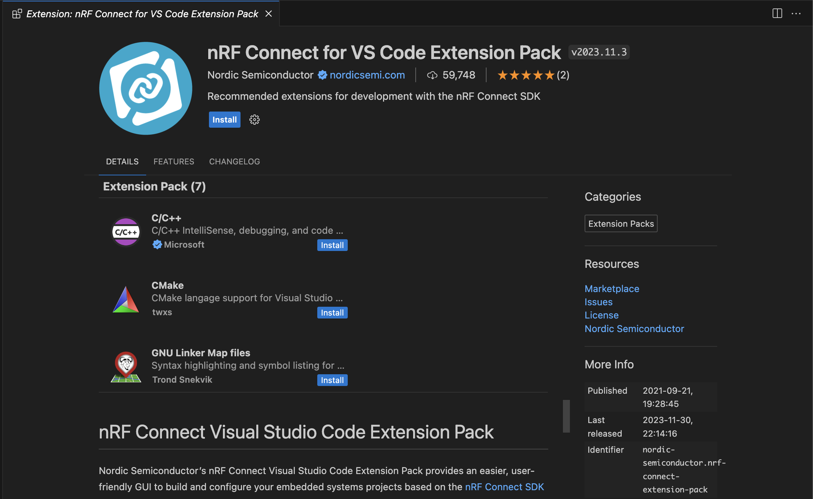
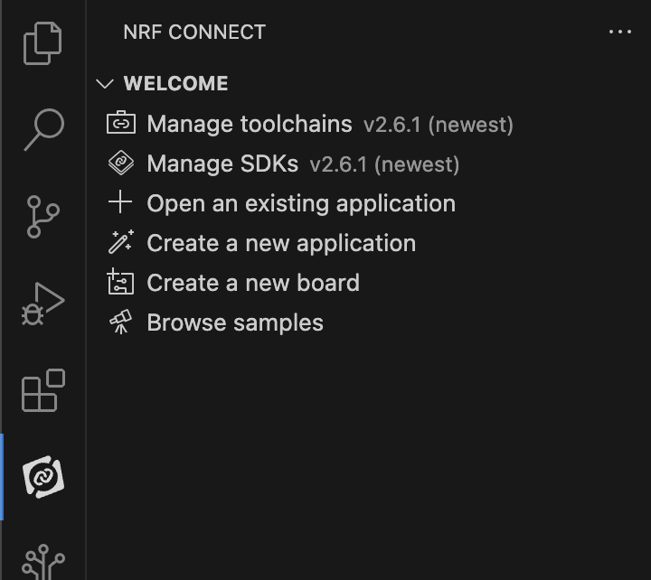

# Getting started with nRF52840 Development Kit

ในบทความนี้ จะจดบันทึกบทเรียน nRF Connect SDK Fundamentals ของ Nordic Dev Academy เพื่อเรียนรู้การพัฒนา Firmware บน nRF Connect SDK กับบอร์ดของ Nordic โดยเฉพาะรุ่น nRF52840 DK (เพราะมีบอร์ดนี้อยู่)

โดยในการพัฒนา Firmware ของ Nordic ส่วนใหญ่จะพัฒนาบนพื้นฐานของ RTOS (real-time operating system) ที่เรียกว่า Zephyr RTOS ซึ่งเป็น open-source และออกแบบมาสำหรับระบบ embedded โดยเฉพาะ รวมไปถึงยังรองรับ MCU รุ่นอื่นๆ อีกมากมาย

สิ่งที่จะได้ตลอดการเรียนรู้นี้คือ
- ข้อมูลพื้นฐาน วิธีการใช้ และตั้งค่า nRF Connect SDK
- การใช้งาน devicetree
- การตั้งค่า software modules ด้วย Kconfig
- ฝึกการใช้งาน hardware peripherals อย่าง UART/SPI/I2C
- รู้จักระบบ Zephyr RTOS เช่น การจัดการ thread, การสื่อสารระหว่าง task เป็นต้น

เดี๋ยวเราจะมาเรียนรู้การติดตั้งและการตั้งค่าเริ่มต้นของ nRF Connect SDK กันก่อน เพราะส่วนที่มักจะมีปัญหา และใช้เวลาในการแก้นานมากๆ โดยเฉพาะกับมือใหม่ๆ (อย่างเรา) คือการ setup พวก library path และการติดตั้งเครื่องมือต่างๆ ให้มันสามารถ build และ flash ลง MCU ได้จนไปถึงการ debug แบบทีละ instruction ซึ่งโชคดีมากๆ ที่ Nordic นั้นทำระบบติดตั้งมาไว้ให้พร้อมแล้ว

## nRF Connect SDK คืออะไร?

nRF Connect SDK (nRF Connect Software Development Kit) คือ SDK ที่ถูกพัฒนาโดยบริษัท Nordic Semiconductor เพื่อใช้สำหรับพัฒนา application ของชิปบริษัทตัวเอง

ด้วย SDK นี้จึงทำให้เราสามารถทำระบบซับซ้อนๆ ได้ง่ายขึ้น รองรับกับพวกอุปกรณ์ทั้งหลายแหล่อย่าง Bluetooth, Wi-Fi และรวมไปถึงพวก middleware อย่าง CoAP, MQTT ได้สะดวกขึ้นด้วย ซึ่งถ้าจะต้องเขียนเองไม่รอดชัวร์

nRF Connect SDK จะมีการวางโครงสร้างของ library ต่างๆ เป็นชั้นๆ โดย Zephyr และ hardware peripheral เป็นฐาน และมี Middleware เป็นตัวกลางเชื่อมกับโค้ดที่เราจะเขียน

การใช้งาน nRF Connect SDK ไม่จำเป็นต้องดาวโหลดแยกเฉพาะบอร์ด หรือเฉพาะเวอร์ชัน สามารถใช้ SDK โค้ดชุดเดียวกันกับทุกๆ บอร์ดได้เลย และ source code เปิด public บน Github

nRF Connect SDK เกิดจากการรวมของ 4 repository หลักนั่นคือ
 - nrf: Applications, samples, connectivity protocols (Nordic)
 - nrfxlib: Common libraries and stacks (Nordic)
 - Zephyr: RTOS & Board configurations (open source)
 - MCUBoot: Secure Bootloader (open source)

และ repository อื่นๆที่เข้ามาช่วยเสริมการพัฒนาระบบให้เราทำงานได้ง่ายและสะดวกขึ้น

ทางด้าน Toolchains ที่ใช้ในการพัฒนาก็ออกแบบมาได้เป็นอย่างดีไม่แพ้กัน มีการใช้ Kconfig เข้ามากำหนดและตั้งค่าทั้งระบบ เช่นการเลืกใช้ protocol หรือ library ภายใน application และใช้ Devicetree สำหรับจัดการกับ hardware จากนั้น CMark จะนำข้อมูลจากทั้ง 2 อย่างมาสร้างไฟล์ build ขึ้นมาและทำการ build ผ่าน ninja โดยใช้ GCC complier ทำการ build ออกมาเป็นไฟล์ที่พร้อมาำหรับการลงระบบ

ด้วยความที่ source code ภาษา C ของเราจะถูกกำหนดและตั้งค่า application ผ่าน Kconfig แยกกับ การจัดการ hardware ด้วย Devicetree ทำให้ง่ายต่อการเขียน application เดียวกันลงบนหลาย hardware ด้วยการเปลี่ยน config เพียงเล็กน้อย มันจะทำให้ง่ายต่อการเปลี่ยนผ่านและการดูแลทั้งตัวอุปกรณ์, source code และ application

## Minimum requirements

### Knowledge
  - ภาษา C อย่างน้อยๆก็ Basic ได้ เขียน hello world เป็น เข้าใจ pointer พอประมาณ

### Hardware
  - nRF52840 DK (development kit board)
  - Micro-USB 2.0 cable

### System
  - คอมพิวเตอร์ใดๆ ก็ตามที่สามารถรันระบบปฏิบัติการ Windows/MacOS/Linux ได้

### Software requirements​
  - ไม่มี เพราะเดี๋ยวจะพาติดตั้งหลังจากนี้

## Installing the nRF Connect SDK

Nordic มีหลายวิธีในการติดตั้ง SDK แต่ในที่นี้จะขอเลือกวิธีที่แนะนำเอาไว้ นั่นคือการใช้ VSCode กับ Extensions สำหรับการพัฒนา หรือใครจะใช้ nRF Connect SDK for Desktop สำหรับการเขียนโค้ดก็ข้ามบทความนี้ไปได้เลย โดยสามารถดูรายละเอียดได้จาก [Link](https://docs.nordicsemi.com/bundle/ncs-latest/page/nrf/installation.html) หรือจะทำตามด้านล่างเลยก็ได้

### 1. Installing nRF Connect SDK and VS Code

#### 1.1 Install nRF Command Line Tools

ตัวแรกที่เราจะติดตั้งก็คือ nRF Command Line Tools เพื่อใช้สำหรับการ build, program และ debug ชิปของ Nordic โดยสามารถ download ได้ที่ official page ด้านล่าง เลือกระบบปฏิบัติการที่ใช้ และติดตั้งได้เลย

[nRF Command Line Tools](https://www.nordicsemi.com/Products/Development-tools/nRF-Command-Line-Tools)

*** บน Linux และ MacOS นั้น จะต้องกดติดตั้ง SEGGER J-Link Software เอง ส่วน Windows จะติดตั้งให้อัตโนมัติ

#### 1.2 Install VS Code and nRF Connect Extension Pack

ตัว VS Code หรือ Visual Studio Code เป็น IDE สำหรับการเขียนโค้ด ก็สามารถ download ได้จาก official page ของ visual studio ติดตั้งเหมือนโปรแกรมทั่วๆ ไป

[Visual Studio Code](https://code.visualstudio.com/Download)

ส่วนของ extensions นั้นจะมีอยู่ 8 extensions ที่จะต้องลง แต่ทาง Nordic เองก็รวบรวมเป็น Extension Pack ไว้ให้แล้ว ซึ่งเราจะกดติดตั้งแค่ 2 extensions ได้แก่

  - [nRF Connect Extension Pack](https://marketplace.visualstudio.com/items?itemName=nordic-semiconductor.nrf-connect-extension-pack): รวม nRF extension ทั้งหมดที่จำเป็นต้องใช้

  - [Cortex-Debug](https://marketplace.visualstudio.com/items?itemName=marus25.cortex-debug) สำหรับ debug ใช้ดูพวก memory หรือ register

โดยหลังจากที่ติดตั้ง VS Code เสร็จสิ้น ก็สามารถกดปุ่ม Install ผ่านหน้าเว็บได้เลย หลังจากนั้น ก็กดปุ่ม Install จากใน VSCode อีกครั้งเพื่อติดตั้งหรือจะใช้วิธีการค้นหาจากชื่อใน VS Code ก็ตามสะดวก

สรุป Extensions ที่ติดตั้งไปคือ

  - nRF Connect for VS Code: เป็น interface ติดต่อกับพวก build system และ nRF Connect SDK รวมไปถึงการจัดการพวก toolchain และ SDK version ด้วย
  - nRF DeviceTree: เพื่อให้ VSCode รองรับกับภาษาและไฟล์ของ Devicetree
  - nRF Kconfig: เพื่อให้ VSCode รองรับกับภาษาและไฟล์ของ Kconfig
  - nRF Terminal: สำหรับการใช้งาน serial and RTT
  - C/C++ from Microsoft: เพื่อให้ VSCode รองรับภาษา C/C++ รวมไปถึงการตัวช่วยเขียนให้เขียนสะดวกขึ้น
  - CMake: เพื่อให้ VSCode รองรับการใช้ CMake
  - GNU Linker Map Files: เพื่อให้ VSCode รองรับไฟล์ Linker map

หลังจากติดตั้งก็จะมีไอคอนขึ้นทางซ้าย ดังรูป

#### 1.3 Install Toolchain and nRF Connect SDK

Toolchain คือโปรแกรมที่เราจะเอามาใช้ร่วมกับ nRF Connect SDK เพื่อทำการ build application ของเราขึ้นมา โดยเราสามารถติดตั้งผ่าน nRF Connect for VS Code ได้เลยโดยการกด `Manage toolchains > Install Toolchain > nRF ConnectSDK Toolchain (version ล่าสุด)` หลังจากนั้นระบบก็จะดาวโหลดให้เอง

และกับ nRF Connect SDK ก็ใช้ท่าเดียวกับการลง Toolchain คือ `Manage SDKs > Install SDK > (stable version ล่าสุด)`
หากไม่มี Manage SDK ให้กด ให้ลองกด `Manage west workspace` ก่อนแล้วเลือก path สำหรับติดตั้ง

### 2. Build and flash your first nRF Connect SDK application

หลังจากติดตั้งเสร็จ ก็ต้องแน่ใจว่าเราจะสามารถทำการ build และ flash ลงบนบอร์ดได้ โดยท่าที่ง่ายที่สุดที่จะทดสอบว่า environment สำหรับการพัฒนา nRF52840 DK พร้อมแล้ว ก็คือโปรแกรมไฟ LED กระพริบใน sample application

การทดสอบก็จะมีดังนี้

1. ที่ nRF Connect Extension จะมี Create a new application อยู่ ให้กด `Create a new application > Copy a sample > Blinky Sample` หลังจากนั้นก็เลือก application path ได้ตามใจชอบ เราก็จะได้ Blinky Sample application ออกมาแล้ว

2. ถัดมา เราจะทำการตั้งค่า build config โดยใน Blinky Sample application กดที่ nRF Connect SDK แล้วสังเกตุที่ด้านล่างซ้าย จะมี application ของเราอยู่ ให้กด `Add build configuration` จะได้หน้าต่าง config ตามรูปข้างล่าง ให้แก้ให้ตรงตามรูปทั้งหมด แล้ว กดปุ่ม Build Configuration ด้านล่าง มันก็จะไปรวมรวบไฟล์ต่างๆ ที่จะต้องใช้มาอยู่ใน folder build

หากต้องการรู้ว่าเราตั้งค่าการ build อะไรไปบ้าง สามารถดูได้จากตารางข้างล่างนี้

| number | title                                | value               | description                                                        |
| ------ | ------------------------------------ | ------------------- | ------------------------------------------------------------------ |
| 1      | Board                                | nrf52840dk_nrf52840 | เป็น ID ของ board ที่เราต้องการ flash ดู ID อื่นๆ ได้จาก website           |
| 2      | Revision                             | -                   | รุ่นของบอร์ด  ดูได้ที่ board ว่าเป็น version ไหน                            |
| 3      | Configuration                        | prj.conf            | การ config board สามารถที่จะปรับเปลี่ยน config ได้จากไฟล์                 |
| 4      | Kconfig fragments                    | -                   | เพิ่มไฟล์สำหรับการ config Linux kernel                                  |
| 5      | Devicetree Overlay                   | -                   | เพิ่มไฟล์สำหรับการขยาย หรือปรับปรุง Devicetree เดิม                         |
| 6      | Extra CMake arguments                | -                   | ส่ง arguments เพิ่มเติมไปยัง build system                               |
| 7      | Build directory name                 | -                   | ชื่อและตำแหน่งของไฟล์ build                                             |
| 8      | Optimization Level                   | Use project default | สำหรับการ optimize การ build โดย                                     |
|        |                                      |                     | Optimize for debugging (-Og) เพื่อการ debug ระบบ (default)           |
|        |                                      |                     | Optimize for speed(-O2) เพื่อการ build ที่ใช้เวลาน้อย เหมาะกับการเทส      |
|        |                                      |                     | Optimize for size (-Os) เพื่อการ build ที่ขนาดเล็กลง เหมาะกับ production |
| 9      | Build after generating configuration | check               | หากมีการสร้าง config ใหม่ จะทำการ Build ให้                             |
| 10     | Use sysbuild                         | uncheck             | เปิดการใช้ system build                                              |

หลังจากสร้าง Build Configuration ก็จะมี tool สำหรับอำนวยความสะดวกในการใช้ดังรูป เราสามารถสั่ง build หรือ flash ได้จากตรงนี้เลย

หากสามารถ build ผ่าน flash สำเร็จ และ board มีไฟกระพริบที่ LED1 ก็จบพิธีการ setup environment ของ nRF บน VS Code แล้ว

## Reference
[Nordic SDK documents](https://docs.nordicsemi.com/bundle/ncs-latest/page/nrf/index.html)
[Lesson 1 – nRF Connect SDK Introduction](https://academy.nordicsemi.com/courses/nrf-connect-sdk-fundamentals/lessons/lesson-1-nrf-connect-sdk-introduction/)
