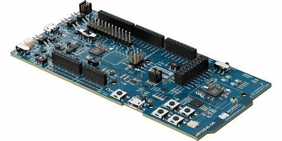
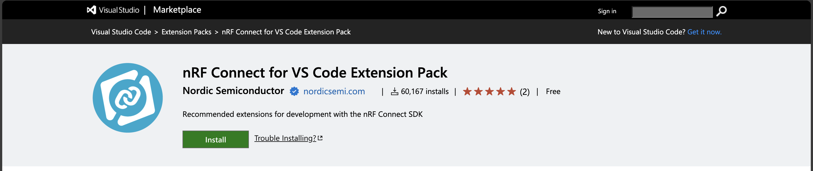
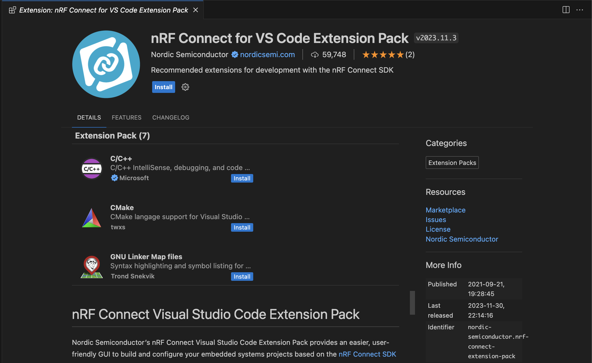
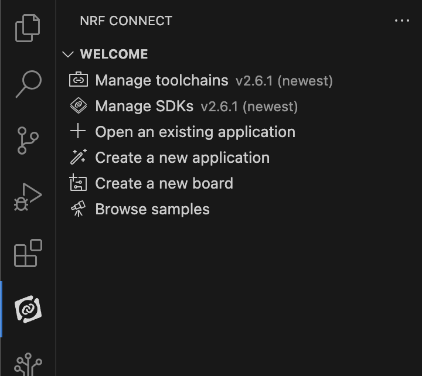
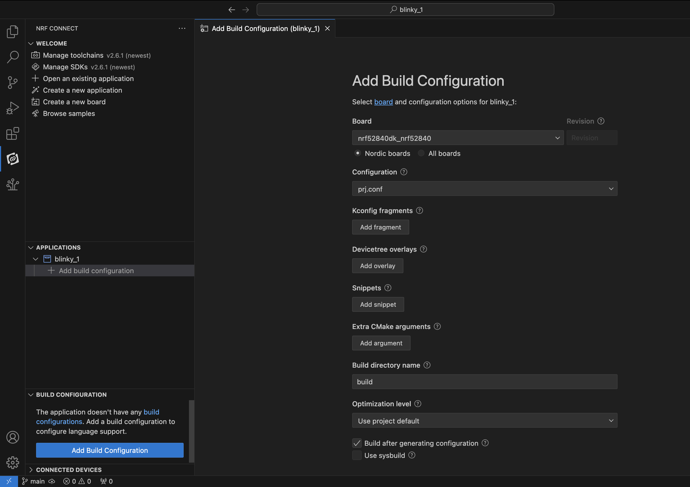
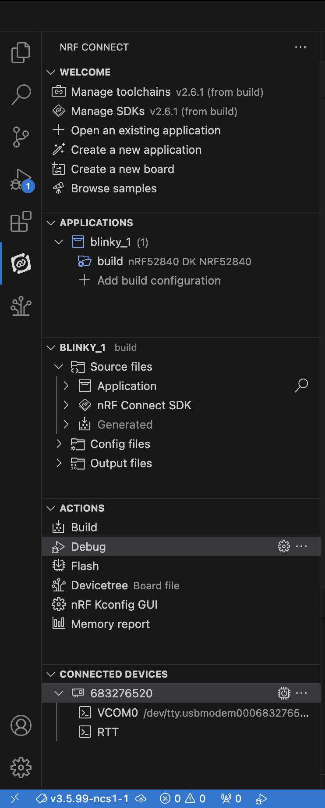

# Getting started with nRF52840 Development Kit

## Minimum requirements

### Hardware
  - nRF52840 DK (development kit board)
  - Micro-USB 2.0 cable

### Software
  - Windows/MacOS/Linux ได้ทุกระบบปฏิบัติการ

## Installing the nRF Connect SDK

มีหลายวิธีในการ install SDK แต่ในที่นี้จะขอเลือกวิธีที่ทาง Nordic recommended เอาไว้ โดยการใช้ VSCode กับ Extension สามารถดูรายละเอียดได้จาก [Link](https://docs.nordicsemi.com/bundle/ncs-latest/page/nrf/installation.html) หรือจะทำตาม instructions ด้านล่างได้เลย

### 1. Installing nRF Connect SDK and VS Code

#### 1.1 Install nRF Command Line Tools

nRF Command Line Tools สามารถ download ได้ที่ official page ด้านล่าง เลือกระบบปฏิบัติการที่ใช้ และติดตั้งได้เลย

[nRF Command Line Tools](https://www.nordicsemi.com/Products/Development-tools/nRF-Command-Line-Tools)

*** บน Linux และ MacOS นั้น จะต้องกดติดตั้ง SEGGER J-Link Software เอง ส่วน Windows จะติดตั้งให้อัตโนมัติ

#### 1.2 Install VS Code and nRF Connect Extension Pack

ตัว VS Code หรือ Visual Studio Code ก็สามารถ download ได้จาก official page ของ visual studio ติดตั้งเหมือนโปรแกรมทั่วๆ ไป

[Visual Studio Code](https://code.visualstudio.com/Download)

ส่วนของ extensions นั้นจะมีอยู่ 8 extensions ที่จะต้องลง แต่ทาง Nordic เองก็รวบรวมเป็น Extension Pack ไว้ให้แล้ว ซึ่งเราจะกดติดตั้งแค่ 2 extensions ได้แก่

  - [nRF Connect Extension Pack](https://marketplace.visualstudio.com/items?itemName=nordic-semiconductor.nrf-connect-extension-pack): รวม nRF extension ทั้งหมดที่จำเป็นต้องใช้

  - [Cortex-Debug](https://marketplace.visualstudio.com/items?itemName=marus25.cortex-debug)

โดยหลังจากที่ install VS Code เสร็จสิ้น ก็สามารถ click ปุ่ม Install ผ่านหน้าเว็บได้เลย หลังจากนั้น ก็กด install จากใน VSCode อีกครั้งเพื่อติดตั้ง หรือจะใช้วิธีการ search จากชื่อใน VS Code ก็ตามสะดวก

สรุป Extensions ที่ติดตั้งไปคือ

  - nRF Connect for VS Code: The main extension containing an interface to the build system and nRF Connect SDK. It also provides an interface to manage nRF Connect SDK versions and toolchains and set an active SDK/toolchain version.
  - nRF DeviceTree: Provides Devicetree language support and the Devicetree Visual Editor.
  - nRF Kconfig: Provides Kconfig language support.
  - nRF Terminal: A serial and RTT terminal.
  - C/C++ from Microsoft: Adds language support for C/C++, including features such as IntelliSense.
  - CMake: CMake language support.
  - GNU Linker Map Files: Linker map files support.

หลังจากติดตั้งก็จะมี icon ขึ้นทางซ้าย ดังรูป

### 1.3 Install Toolchain and nRF Connect SDK

Toolchain คือโปรแกรมที่เราจะเอามาใช้ร่วมกับ nRF Connect SDK เพื่อทำการ build application ของเราขึ้นมา โดยเราสามารถติดตั้งผ่าน nRF Connect for VS Code ได้เลยโดยการกด `Manage toolchains > Install Toolchain > nRF ConnectSDK Toolchain (version ล่าสุด)` หลังจากนั้นระบบก็จะดาวโหลดให้เอง

และกับ nRF Connect SDK ก็ใช้ท่าเดียวกับการลง Toolchain คือ `Manage SDKs > Install SDK > (stable version ล่าสุด)`
หากไม่มี Manage SDK ให้กด ให้ลองกด `Manage west workspace` ก่อนแล้วเลือก path สำหรับติดตั้ง

## 2. Build and flash your first nRF Connect SDK application

หลังจากติดตั้งเสร็จ ก็ต้องแน่ใจว่าเราจะสามารถทำการ build และ flash ลงบนบอร์ดได้ โดยท่าที่ง่ายที่สุดที่จะทดสอบว่า environment สำหรับการพัฒนา nRF52840 DK พร้อมแล้ว ก็คือโปรแกรมไฟ LED กระพริบใน sample application

การทดสอบก็จะมีดังนี้

1. ที่ nRF Connect Extension จะมี Create a new application อยู่ ให้กด `Create a new application > Copy a sample > Blinky Sample` หลังจากนั้นก็เลือก application path ได้ตามใจชอบ เราก็จะได้ Blinky Sample application ออกมาแล้ว

2. ถัดมา เราจะทำการตั้งค่า build config โดยใน Blinky Sample application กดที่ nRF Connect SDK แล้วสังเกตุที่ด้านล่างซ้าย จะมี application ของเราอยู่ ให้กด `Add build configuration` จะได้หน้าต่าง config ตามรูปข้างล่าง ให้แก้ให้ตรงตามรูปทั้งหมด แล้ว กดปุ่ม Build Configuration ด้านล่าง มันก็จะไปรวมรวบไฟล์ต่างๆ ที่จะต้องใช้มาอยู่ใน folder build

หากต้องการรู้ว่าเราตั้งค่าการ build อะไรไปบ้าง สามารถดูได้จากตารางข้างล่างนี้

| number | title                                | value               | description                                                        |
| ------ | ------------------------------------ | ------------------- | ------------------------------------------------------------------ |
| 1      | Board                                | nrf52840dk_nrf52840 | เป็น ID ของ board ที่เราต้องการ flash ดู ID อื่นๆ ได้จาก website           |
| 2      | Revision                             | -                   | รุ่นของบอร์ด  ดูได้ที่ board ว่าเป็น version ไหน                            |
| 3      | Configuration                        | prj.conf            | การ config board สามารถที่จะปรับเปลี่ยน config ได้จากไฟล์                 |
| 4      | Kconfig fragments                    | -                   | เพิ่มไฟล์สำหรับการ config Linux kernel                                  |
| 5      | Devicetree Overlay                   | -                   | เพิ่มไฟล์สำหรับการขยาย หรือปรับปรุง Devicetree เดิม                         |
| 6      | Extra CMake arguments                | -                   | ส่ง arguments เพิ่มเติมไปยัง build system                               |
| 7      | Build directory name                 | -                   | ชื่อและตำแหน่งของไฟล์ build                                             |
| 8      | Optimization Level                   | Use project default | สำหรับการ optimize การ build โดย                                     |
|        |                                      |                     | Optimize for debugging (-Og) เพื่อการ debug ระบบ (default)           |
|        |                                      |                     | Optimize for speed(-O2) เพื่อการ build ที่ใช้เวลาน้อย เหมาะกับการเทส      |
|        |                                      |                     | Optimize for size (-Os) เพื่อการ build ที่ขนาดเล็กลง เหมาะกับ production |
| 9      | Build after generating configuration | check               | หากมีการสร้าง config ใหม่ จะทำการ Build ให้                             |
| 10     | Use sysbuild                         | uncheck             | เปิดการใช้ system build                                              |

หลังจากสร้าง Build Configuration ก็จะมี tool สำหรับอำนวยความสะดวกในการใช้ดังรูป เราสามารถสั่ง build หรือ flash ได้จากตรงนี้เลย

หากสามารถ build ผ่าน flash สำเร็จ และ board มีไฟกระพริบที่ LED1 ก็จบพิธีการ setup environment ของ nRF บน VS Code ถัดไป

เราจะเริ่มสร้าง Application ใหม่ โดยเริ่มจาก Blank application

## Reference
[Nordic SDK documents](https://docs.nordicsemi.com/bundle/ncs-latest/page/nrf/index.html)
[Lesson 1 – nRF Connect SDK Introduction](https://academy.nordicsemi.com/courses/nrf-connect-sdk-fundamentals/lessons/lesson-1-nrf-connect-sdk-introduction/)
