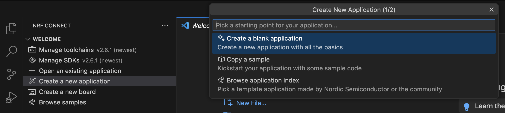
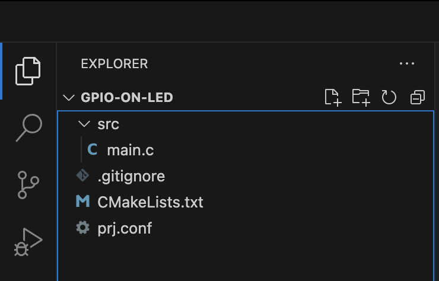

#

มาต่อกันกับการเรียนรู้เรื่อง nRF Connect SDK ในบทความนี้ เราจะมาเรียนรู้กันในเรื่องของ hardware configuration และ interaction กันระหว่าง application กับ hardware ผ่านสิ่งที่เรียกว่า driver เดี๋ยวมาดูกันว่าเราจะเขียนส่วนของ driver configuration ยังไงผ่านการใช้ของง่ายๆ อย่าง GPIO โดยการทำไฟเปิด/ปิดจากการกดปุ่มกัน


สิ่งที่จะได้คือ
- อ่านไฟล์ devicetree เป็น
- เข้าใจในเรื่องของ devicetree API และการเขียน devicetree และ binding file


## Drivetree

การเขียน firmware บน nRF Connect SDK นั้นจะอยู่บนฐานของ zephyr RTOS โดยใช้


A devicetree is a hierarchical data structure that describes hardware. The hardware described could be a development kit, SoC, SiP, module, defining everything ranging from the GPIO configurations of the LEDs on a development kit to the memory-mapped locations of peripherals. The devicetree uses a specific format consisting of nodes connected together, where each node contains a set of properties.


## Excise

### 1

เริ่มจากสร้าง application เปล่าๆ ด้วย nRF Connect ด้วยคำสั่ง `Create a new application > Create a blank application` ดังรูป ตั้งชื่อได้ตามสะดวก แล้วระบบจะทำการ generate ไฟล์ที่จำเป็นมาให้





โดยแต่ละไฟล์ คืิอ
- src
  - main.c        // จุดเริ่มต้นของโปรแกรม
- .gitignore      // บอก git ว่าไฟล์ไหน จะไม่เอาขึ้น git repository
- CMakeLists.txt  // ช่วยจัดการ compiler และเชื่อม library หรือไฟล์ต่างๆเข้ามาใน project
- prj.conf        // configuration ของ project

ถัดมา เราจะมาสร้าง build configuration และลอง flash ดูก่อนเพื่อให้มั่นใจว่าเรายังสามารถที่จะ flash formware ลงบอร์ดได้ตามปกติ วิธีการก็สามารถทำแบบ part แรกได้เลย

เมื่อทำการลอง build และ flash สำเร็จ ก็มาทำส่วนถัดไปได้เลย

### 2 Unit Testing

ส่วนสำคัญที่เราควรจะทำก่อนที่จะลุยเขียนโค้ดก็คือ การเขียน test หรือการทำการจำลองผลลัพธ์ที่เราต้องการออกมาเพื่อใช้เป็นเป้าหมายในการเขียนโค้ดในแต่ละรอบ โดย Unit Test Framework ที่เราจะใช้นั่นก็คือ ztest จาก zephyr นั่นเอง

โครงสร้าง project จะถูกปรับเปลี่ยนดังนี้
```
- src
  - main.c
- tests
  - CMakeLists.txt
  - src
    - test_main.c
- .gitignore
- CMakeLists.txt
- prj.conf
```


## Reference
[Nordic SDK documents](https://docs.nordicsemi.com/bundle/ncs-latest/page/nrf/index.html)
[Lesson 1 – nRF Connect SDK Introduction](https://academy.nordicsemi.com/courses/nrf-connect-sdk-fundamentals/lessons/lesson-1-nrf-connect-sdk-introduction/)
